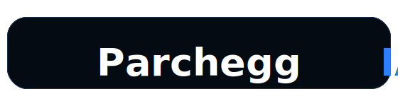
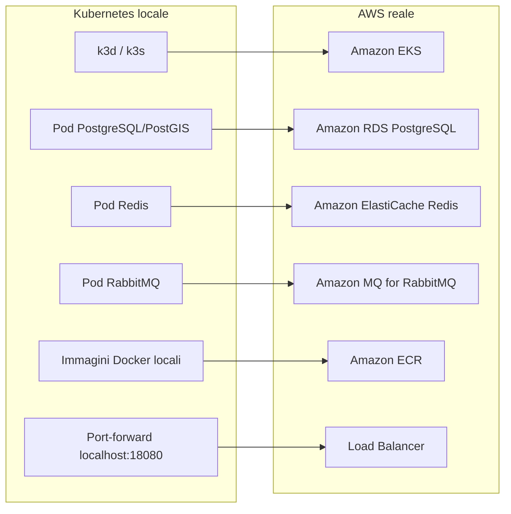
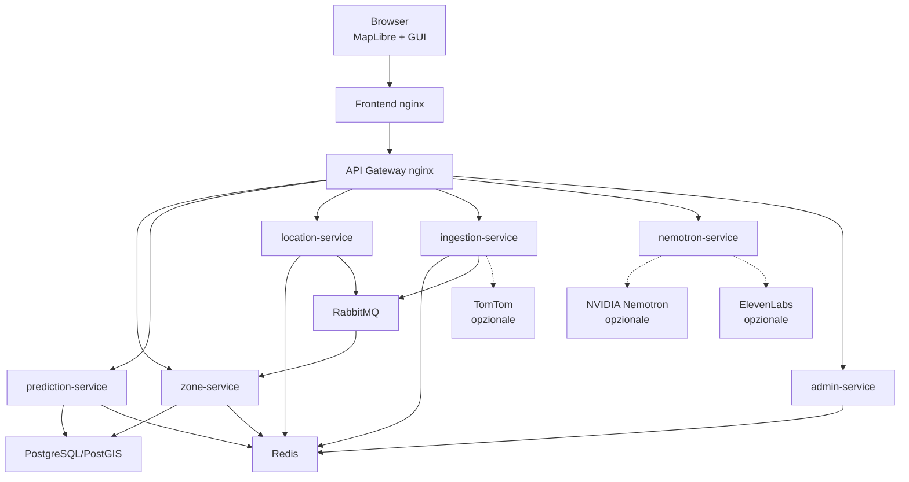
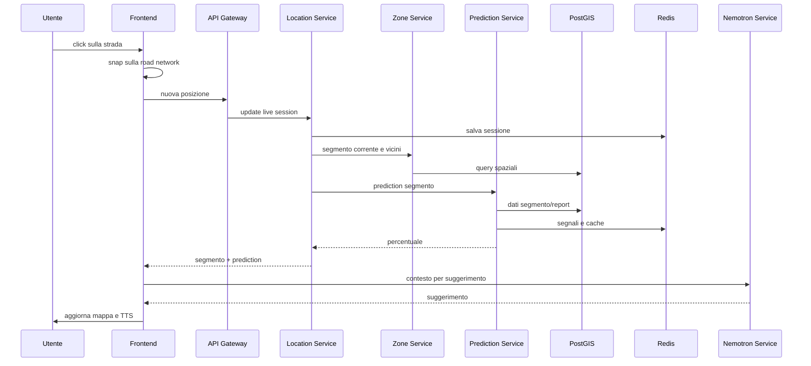

<p align="center">
  
</p>

# ParcheggIA

ParcheggIA è un'app cloud-native che prova a stimare dove sia più probabile trovare parcheggio nelle vicinanze dell'utente.

Invece di dire "questa zona è piena" oppure "questa zona è libera", l'app ragiona su piccoli tratti di strada. Nella GUI si vede una mappa stile navigatore, con heatmap, percentuali sui segmenti, marker dei parcheggi, suggerimenti AI e text to speech.

Il progetto è pensato per funzionare in tre modi:

- in locale con Docker Compose;
- in Kubernetes locale con k3d, così si simula una piccola architettura cloud;
- su AWS, usando EKS, RDS, ElastiCache, Amazon MQ, ECR, VPC, Load Balancer, SSM, CloudWatch, Lambda ed EventBridge.

Non servono API key per provarlo. Se TomTom, Nemotron o ElevenLabs non sono configurati, l'app usa dati OSM reali, stime simulate e fallback locali.

## Avvio rapido

Prerequisiti:

- Git;
- Docker o un runtime compatibile;
- su macOS va bene Docker Desktop oppure Colima;
- su Windows è consigliato WSL2 con Docker Desktop;
- almeno qualche GB libero per immagini, database e container.

Clona la repo e avvia tutto:

```bash
git clone https://github.com/AlbertoBocchieri/Progetto-Sistemi-Cloud.git
cd Progetto-Sistemi-Cloud
docker compose up -d --build
```

Poi apri:

```text
http://localhost:8080
```

Per controllare che i container siano partiti:

```bash
docker compose ps
```

Per eseguire uno smoke test:

```bash
scripts/smoke_test.sh
```

Per fermare tutto:

```bash
docker compose down
```

Per cancellare anche i dati del database e ripartire da zero:

```bash
docker compose down -v
```

Al primo avvio è normale aspettare un po', dato che il database importa i segmenti OSM reali di Catania e applica gli override sulle strisce blu.

## Windows

Su Windows il modo più stabile è usare WSL2.

Setup consigliato:

- installa WSL2 con Ubuntu;
- installa Docker Desktop;
- abilita l'integrazione di Docker Desktop con Ubuntu/WSL;
- clona la repo dentro il filesystem Linux, ad esempio in `~/Progetto-Sistemi-Cloud`;
- esegui i comandi dal terminale Ubuntu, non da PowerShell;
- apri l'app dal browser Windows su `http://localhost:8080`.

Esempio:

```bash
sudo apt update
sudo apt install -y git curl
git clone https://github.com/AlbertoBocchieri/Progetto-Sistemi-Cloud.git
cd Progetto-Sistemi-Cloud
docker compose up -d --build
```

Se uno script non parte perché non è eseguibile:

```bash
chmod +x scripts/*.sh
```

## Simulazione architettura cloud in locale

Questa modalità serve per simulare il progetto in Kubernetes localmente senza creare risorse AWS.

Su macOS si possono installare i tool così:

```bash
brew install colima k3d kubernetes-cli helm
```

Se usi Colima:

```bash
scripts/colima_start.sh
```

Poi avvia la simulazione:

```bash
scripts/cloud_sim_local_up.sh
```

Lo script:

- crea o riusa un cluster k3d;
- builda le immagini Docker;
- le importa nel cluster;
- deploya PostgreSQL/PostGIS, Redis, RabbitMQ e i microservizi;
- importa i dati OSM;
- fa uno smoke test;
- espone il frontend su:

```text
http://localhost:18080
```

Il terminale deve rimanere aperto perché mantiene i port-forward.

Per spegnere:

```bash
scripts/cloud_sim_local_down.sh
```

La simulazione locale corrisponde più o meno a questa mappatura:



## Deploy Cloud Reale Su AWS

<p align="center">
  
</p>

Requisiti:

- account AWS;
- AWS CLI configurata;
- Terraform;
- kubectl;
- Docker;
- permessi per EKS, EC2/VPC, ECR, RDS, ElastiCache, Amazon MQ, SSM, CloudWatch, Lambda ed EventBridge.

Configura un profilo AWS:

```bash
aws configure --profile parcheggia-dev
```

Il nome `parcheggia-dev` sarà il nome locale del profilo AWS CLI. Durante il comando vanno copiati i valori dal CSV delle access key scaricato da AWS:

```text
AWS Access Key ID: valore della colonna "Access key ID"
AWS Secret Access Key: valore della colonna "Secret access key"
Default region name: eu-south-1
Default output format: json
```

Verifica:

```bash
aws sts get-caller-identity --profile parcheggia-dev
```

### Segreti AWS Con SSM

Nel deploy cloud le password e le API key non sono scritte nella repo. Vengono salvate in AWS Systems Manager Parameter Store, che nella console AWS si trova in:

```text
Systems Manager -> Parameter Store
```

Il progetto usa il prefisso:

```text
/parcheggia/dev
```

I parametri più importanti sono:

```text
/parcheggia/dev/secrets/postgres-password
/parcheggia/dev/secrets/rabbitmq-password
/parcheggia/dev/secrets/tomtom-api-key
/parcheggia/dev/secrets/nemotron-api-key
/parcheggia/dev/secrets/elevenlabs-api-key
/parcheggia/dev/secrets/github-actions-token
```

Le password di PostgreSQL e RabbitMQ servono al cloud. Le chiavi TomTom, Nemotron ed ElevenLabs sono opzionali: se non ci sono, l'app parte comunque e usa simulazioni/fallback. I valori sensibili sono salvati come `SecureString`, quindi non vanno stampati nei log o copiati nei manifest Kubernetes.

Per caricare i valori da un `.env` locale verso SSM:

```bash
export AWS_PROFILE=parcheggia-dev
export AWS_REGION=eu-south-1
scripts/aws_ssm_sync_env.sh
```

Per controllare che i parametri esistano senza mostrare i valori:

```bash
scripts/aws_ssm_check_config.sh
```

Durante il deploy, lo script:

1. legge gli output Terraform, per esempio endpoint RDS, Redis e RabbitMQ;
2. legge i segreti da SSM;
3. crea nel cluster Kubernetes una `ConfigMap` per la configurazione normale;
4. crea un `Secret` Kubernetes per password e API key (se presenti).

In pratica i pod non leggono direttamente da SSM: ricevono variabili ambiente tramite `ConfigMap` e `Secret` Kubernetes generati dagli script.

Per vedere cosa verrebbe creato:

```bash
scripts/cloud_plan.sh
```

Per accendere la demo cloud:

```bash
CONFIRM_APPLY=apply-parcheggia-dev scripts/cloud_demo_up.sh
```

Per spegnere:

```bash
CONFIRM_DESTROY=destroy-parcheggia-dev scripts/cloud_down.sh
```

Il progetto include anche un auto-spegnimento con Lambda/EventBridge che viene schedulato automaticamente quando viene fatto il deploy cloud, questo spegnerà tutto dopo 4 ore.
Si può comunque controllare lo stato con il comando:

```bash
scripts/cloud_status.sh
```

## Cosa funziona senza API Key

La demo è stata concepita per partire anche senza chiavi esterne.

Senza API key:

- la mappa funziona;
- i segmenti OSM reali vengono caricati;
- la heatmap viene mostrata;
- le percentuali vengono simulate in modo realistico;
- i suggerimenti AI hanno un fallback locale;
- il TTS può usare il browser;
- TomTom, Nemotron ed ElevenLabs non vengono chiamati.

Con API key configurate:

- TomTom migliora le stime con traffico, incidenti e POI parcheggi;
- Nemotron genera suggerimenti reali;
- ElevenLabs genera una voce più naturale.

Le chiavi non vengono mai esposte.

## Architettura

Questa è la struttura generale:



Il browser parla solo con il gateway. Questo è importante perché:

- le API key restano nel backend
- si può controllare il consumo delle API esterne
- il frontend non deve conoscere la struttura interna

## Stack Tecnologico

| Parte | Tecnologie |
|---|---|
| Frontend | HTML, CSS, JavaScript vanilla |
| Mappa | MapLibre GL JS, PMTiles |
| Backend | Python FastAPI |
| Gateway | Nginx |
| Database | PostgreSQL + PostGIS |
| Cache/stato | Redis |
| Eventi | RabbitMQ |
| AI | NVIDIA Nemotron, con fallback |
| TTS | ElevenLabs, con fallback browser |
| Container | Docker |
| Sviluppo locale | Docker Compose |
| Kubernetes locale | k3d/k3s |
| Cloud | AWS EKS, RDS, ElastiCache, Amazon MQ, ECR, VPC, Load Balancer, SSM Parameter Store, CloudWatch, Lambda, EventBridge |
| IaC | Terraform |
| CI/CD | GitHub Actions |

Non sono stati usati React, TypeScript o Spring Boot. All'inizio erano opzioni possibili, ma alla fine il progetto è andato su una soluzione più semplice: frontend vanilla, gateway Nginx e microservizi FastAPI.

## Servizi Locali

| Servizio | Porta | Cosa fa |
|---|---:|---|
| `frontend` | 8080 | Serve la GUI |
| `api-gateway` | 8000 | Smista le richieste verso i servizi |
| `zone-service` | 8001 | Segmenti, strade, report, dati geografici |
| `ingestion-service` | 8002 | TomTom, scenari demo, eventi |
| `nemotron-service` | 8003 | Suggerimenti AI e TTS |
| `prediction-service` | 8004 | Calcolo percentuali e heatmap |
| `location-service` | 8005 | Sessioni live e posizione utente |
| `admin-service` | 8006 | Diagnostica e reset demo |
| `postgres` | 5432 | PostgreSQL/PostGIS |
| `redis` | 6379 | Cache e stato live |
| `rabbitmq` | 5672 / 15672 | Broker eventi e interfaccia web |

RabbitMQ Management:

```text
http://localhost:15672
utente: parcheggia
password: parcheggia
```

## Frontend

Il frontend è volutamente semplice: niente framework, niente build complessa. La parte interessante è MapLibre.

File principali:

- `frontend/index.html`
- `frontend/styles.css`
- `frontend/app.js`
- `frontend/assets/catania.pmtiles`

La GUI mostra:

- posizione utente;
- heatmap continua sui segmenti;
- marker con percentuale;
- marker parcheggi;
- suggerimenti AI;
- TTS;
- tema scuro/chiaro;
- simulazione guida.

Alcune costanti importanti in `frontend/app.js`:

```text
LOCAL_RADIUS_M = 500
PARKING_POI_RADIUS_M = 500
ROAD_NETWORK_RADIUS_M = 700
MAP_DEFAULT_ZOOM = 18.6
MAP_TRACKING_ZOOM = 19.1
TOMTOM_PREDICTION_REFRESH_MS = 5 minuti
```

La basemap è locale:

```text
frontend/assets/catania.pmtiles
```

Così non servono chiavi per MapTiler, Stadia o TomTom Map Display.

## Backend

### API Gateway

Il gateway è Nginx. Riceve le richieste dal browser e le inoltra al servizio giusto.

Esempi:

- `/api/v1/live-sessions` va al `location-service`;
- `/api/v1/segment-heatmap` va al `prediction-service`;
- `/api/v1/tomtom/...` va all'`ingestion-service`;
- `/ai/...` va al `nemotron-service`;
- molte API sui segmenti vanno al `zone-service`.

### Zone Service

Gestisce la parte geografica:

- segmenti stradali;
- segmento corrente;
- segmenti vicini;
- road network;
- report;
- consumer RabbitMQ;
- API legacy sulle zone.

Usa PostGIS per le query spaziali e Redis per cache/segnali.

### Prediction Service

Calcola la percentuale di parcheggiabilità.

Il modello non usa machine learning, ma è rule-based.
Tiene conto di:

- tipo sosta;
- report utente;
- segnali Redis;
- eventuali dati TomTom;
- ora e giorno;
- distanza.

Il calcolo della "parcheggiabilità" è il seguente:

```text
percentuale =
  baseline_tipo_sosta
  + correzione_report
  + correzione_traffico_tomtom_o_simulato
  + correzione_incidenti
  + correzione_orario
  + correzione_distanza
```

Poi il risultato viene normalizzato tra `0` e `100`.

Le baseline iniziali sono:

```text
strisce blu          42%
probabile libero     48%
limitato             14%
sconosciuto          42%
```

Le correzioni principali a questa percentuale derivano da:

- i report recenti degli utenti che possono spostare la stima di circa `-15/+15`;
- traffico e incidenti, reali o simulati, possono spostarla di circa `-35/+20`;
- l'orario peggiora la stima nelle ore più trafficate e la migliora leggermente di notte o nel weekend;
- i segmenti più lontani dall'utente pesano meno rispetto a quelli vicini.

Accanto alla percentuale viene calcolata anche una `confidence`, cioè quanto il sistema si fida della stima. Una stima con dati reali recenti e report coerenti avrà confidence più alta, mentre una stima solo simulata o inferita sarà più prudente.

Gli stati visuali sono:

```text
< 20%      molto difficile
20-39%     difficile
40-59%     incerto
60-79%     buono
>= 80%     favorevole
```

### Location Service

Tiene traccia della sessione live dell'utente.

Quando arriva una nuova posizione:

- salva la sessione su Redis;
- chiede al `zone-service` il segmento corrente;
- chiede al `prediction-service` la stima;
- pubblica un evento su RabbitMQ.

### Ingestion Service

Si occupa dei dati esterni e degli scenari demo.

Con TomTom configurato può usare:

- Traffic Flow;
- Traffic Incidents;
- Search API per trovare parcheggi vicini.

Ha anche un budget guard su Redis per non consumare troppe chiamate.

### Nemotron Service

Genera suggerimenti per l'utente.

Se la API key Nemotron è presente usa:

```text
nvidia/nemotron-3-nano-30b-a3b
```

Se non è presente usa un fallback simulato.

Per il TTS usa ElevenLabs se configurato, altrimenti il frontend può usare il TTS del browser.

## Modello dati

Il database principale è PostgreSQL con PostGIS.

Le entità più importanti sono:

- `parking_segments`: piccoli tratti stradali;
- `road_edges` e `road_nodes`: rete stradale usata per snap e simulazione;
- `parking_lots`: parcheggi;
- `segment_reports`: segnalazioni utente sui segmenti;
- tabelle legacy `zones` e `user_reports`, mantenute per compatibilità.

I segmenti possono avere tipi di sosta come:

- `blue`: strisce blu;
- `probable_free`: probabilmente libero;
- `restricted`: limitato;
- `unknown`: non noto.

La parte geografica usa coordinate EPSG:4326 e indici GIST.

## Import OSM

I dati delle strade arrivano da OpenStreetMap.

File importanti:

- `data/osm/catania_segments.sql`
- `data/osm/catania_blue_overrides.sql`
- `scripts/import_osm_segments.py`
- `scripts/check_osm_import.py`

Al primo avvio `db-init`:

1. crea le tabelle;
2. importa i segmenti OSM se non sono già presenti;
3. applica gli override per le strisce blu.

Abbiamo scelto di importare OSM in PostGIS invece di leggere le strade direttamente da MapLibre perché i tile della mappa servono a disegnare, non a fare analisi affidabile su segmenti, report e predizioni.

## TomTom

TomTom non viene chiamato dal frontend. Viene usato solo dal backend.

Le API usate sono:

- Traffic Flow API;
- Traffic Incidents API;
- Search API.

Traffic Flow dà informazioni come:

- velocità corrente;
- velocità a traffico libero;
- confidence;
- chiusura strada.

Traffic Incidents dà informazioni su:

- incidenti;
- lavori;
- ritardi;
- code;
- tratti chiusi.

Search API viene usata per trovare parcheggi vicini, non per sapere quanti posti liberi ci sono.

Per risparmiare chiamate:

- raggio locale di 500 metri;
- celle cache da circa 250 metri;
- TTL di 5 minuti per la prediction;
- TTL di 24 ore per i POI parcheggi;
- budget guard al 5% della quota mensile in modalità test.

## AI e TTS

Il suggerimento AI viene generato con contesto locale:

- strada corrente;
- percentuale;
- segmenti vicini;
- parcheggi vicini;
- tipo sosta;
- confidence.

Il prompt chiede consigli pratici, brevi e in italiano, evitando frasi troppo tecniche.

Esempio del tipo di suggerimento:

```text
Prosegui su Via Caronda, cerca strisce blu a 44 metri; in alternativa vai verso Via Palazzotto al 46%.
```

Il TTS:

- usa ElevenLabs se c'è la key;
- usa modello `eleven_flash_v2_5`;
- ha similarity al 50%;
- ha style/exaggeration al 25%;
- altrimenti usa il browser.

## Flusso pratico

Quando l'utente clicca su una strada:



## API Principali

Segmenti:

```text
GET /api/v1/segments
GET /api/v1/segments/current?lat=&lon=
GET /api/v1/segments/nearby?lat=&lon=&radius_m=500
GET /api/v1/segments/{segment_id}/prediction
GET /api/v1/segment-heatmap?bbox=&zoom=
POST /api/v1/segment-reports
```

Rete stradale:

```text
GET /api/v1/road-network?lat=&lon=&radius_m=700
```

Sessioni live:

```text
POST /api/v1/live-sessions/start
POST /api/v1/live-sessions/{session_id}/location
POST /api/v1/live-sessions/{session_id}/stop
```

TomTom:

```text
POST /ingestion/traffic/tomtom/publish
GET /ingestion/traffic/tomtom/budget
GET /api/v1/tomtom/parking-pois
```

AI:

```text
GET /ai/ready
POST /ai/explain
POST /ai/tts
```

Admin:

```text
GET /api/v1/admin/source-health
GET /api/v1/admin/events
POST /api/v1/admin/demo-scenarios/reset
```

## GitHub Actions

La repo contiene workflow per:

- controlli CI;
- build Docker;
- build e push immagini su ECR;
- Terraform plan/apply;
- deploy locale k3d;
- deploy EKS;
- spegnimento cloud.

### Cosa succede dopo un push

Quando viene fatto un push su `main`, GitHub Actions esegue automaticamente i workflow principali:

1. parte la CI, che esegue controlli statici, avvia lo stack con Docker Compose e lancia smoke test/test demo;
2. parte la build Docker, che verifica che tutte le immagini dei servizi siano costruibili;
3. se i segreti AWS del repository sono configurati, parte anche la build ECR;
4. il workflow ECR fa login su Amazon ECR, costruisce le immagini e le pubblica nei repository AWS;
5. ogni immagine viene taggata almeno con `latest` e con lo SHA del commit, così si può risalire alla versione esatta del codice.

Il flusso ECR è questo:

```text
push su main
        ↓
GitHub Actions
        ↓
docker build dei servizi
        ↓
login su Amazon ECR
        ↓
push immagini su ECR
        ↓
EKS può scaricare quelle immagini durante il deploy
```

Il push su GitHub non fa partire automaticamente il deploy su AWS. Aggiorna le immagini su ECR, ma il deploy EKS resta un passaggio controllato, da script locale o workflow manuale, per evitare di creare o aggiornare risorse cloud a ogni commit.


Workflow principali:

- `.github/workflows/ci.yml`
- `.github/workflows/docker-build.yml`
- `.github/workflows/ecr-build.yml`
- `.github/workflows/deploy-local.yml`
- `.github/workflows/deploy-eks.yml`
- `.github/workflows/terraform-plan.yml`
- `.github/workflows/terraform-apply.yml`
- `.github/workflows/cloud-down.yml`

## Test

Comandi utili:

```bash
scripts/static_checks.sh
scripts/smoke_test.sh
scripts/e2e_demo_test.sh
scripts/check_frontend.py
scripts/check_tomtom.py
scripts/check_osm_import.py
scripts/check_road_backed_segments.py
scripts/check_scoring.py
```

Per Kubernetes:

```bash
scripts/k8s_smoke_test.sh
```

Per test base di carico:

```bash
scripts/load_test.sh
```


### Il primo avvio è lento

È normale. Il database sta importando i segmenti OSM.

Controlla:

```bash
docker compose logs db-init
```

## Struttura Della Repo

```text
frontend/                         GUI MapLibre
services/api-gateway/             gateway Nginx
services/zone-service/            segmenti, strade, report
services/prediction-service/      calcolo parkability
services/location-service/        sessioni live
services/ingestion-service/       TomTom e scenari demo
services/nemotron-service/        suggerimenti AI e TTS
services/admin-service/           diagnostica
data/osm/                         dati OSM e override
infrastructure/k8s/               manifest Kubernetes
infrastructure/terraform/aws/     infrastruttura AWS
infrastructure/ansible/           playbook locali
scripts/                          script di avvio, test e deploy
docs/                             documentazione extra
```

## Documentazione Extra

Per approfondire:

- `docs/architecture.md`
- `docs/data-model.md`
- `docs/cloud-deployment.md`
- `docs/kubernetes-local.md`
- `docs/iac-aws.md`
- `docs/event-flow.md`
- `docs/test-plan.md`
- `docs/verification-matrix.md`
